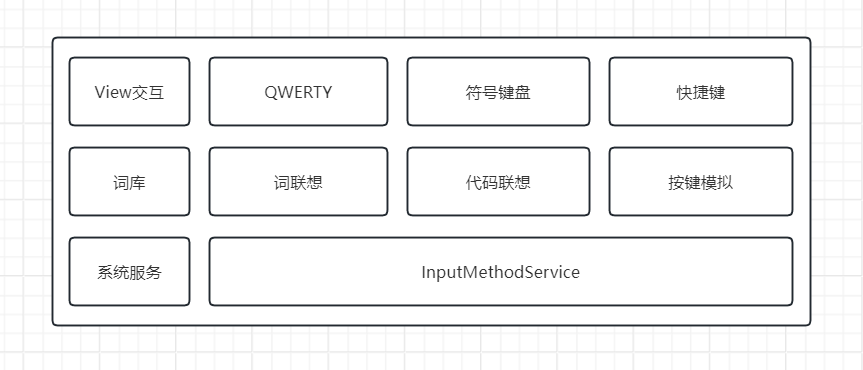

# LCodeBoard
一个带关键词联想的输入法。

## 层次结构

- System（系统服务）
- InputMethodService（输入法服务）-- IMEService
- IMEHandler（事件总线） -- ConnectionProvider
- Language（语言） -- Glossary
- KeyboardView（键盘视图） -- InputLayer
- User（用户）

